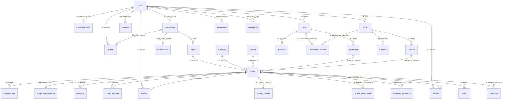

# RazorHub — Complete Database Schema Reference

This document provides the full database schema specification for **RazorHub**, detailing all 32 models across 7 backend applications, including data types, relational mappings, constraints, indexes, and AI-commerce extensions.

---

## 1. Database Architecture & Tech Stack

- **Development Engine:** SQLite (`backend/db.sqlite3`)
- **Production Engine:** PostgreSQL (e.g. Render / Neon)
- **Vector Search:** `pgvector` extension for 1536-dimensional semantic product embeddings (with JSON fallback for SQLite dev)
- **ORM / Framework:** Django 6 + Django REST Framework
- **Primary Authentication:** Custom User model (`users.User`) with JWT & Google OAuth support

---

## 2. Entity-Relationship Diagram (ERD)

---

## 3. Application Models & Field Definitions

---

### 1. Identity & Users (`users`)

Defined in [backend/users/models.py](file:///c:/Users/krbur/OneDrive/Desktop/RazorHub/backend/users/models.py).

#### **`User`** (`users_user`)
Custom user model extending `django.contrib.auth.models.AbstractUser`.
- `id` (`BigAutoField`, PK, Auto-increment)
- `email` (`EmailField`, Unique, Not Null) — `USERNAME_FIELD`
- `username` (`CharField(150)`, Not Null)
- `role` (`CharField(20)`, Choices: `customer`, `seller`, `admin`, Default: `customer`)
- `phone` (`CharField(20)`, Nullable, Blank)
- `address` (`TextField`, Nullable, Blank)
- `otp_code` (`CharField(6)`, Nullable, Blank) — One-time verification token
- `otp_created_at` (`DateTimeField`, Nullable, Blank)
- `is_staff` (`BooleanField`, Default: `False`)
- `is_active` (`BooleanField`, Default: `True`)
- `is_superuser` (`BooleanField`, Default: `False`)
- `last_login` (`DateTimeField`, Nullable)
- `date_joined` (`DateTimeField`, Auto now add)

#### **`CustomerProfile`** (`users_customerprofile`)
- `id` (`BigAutoField`, PK)
- `user` (`OneToOneField` -> `User`, `CASCADE`, related_name=`customer_profile`)
- `full_name` (`CharField(200)`, Blank)
- `notes` (`TextField`, Blank)
- `lifetime_value` (`DecimalField(12, 2)`, Default: `0.00`)
- `created_at` (`DateTimeField`, Auto now add)
- `updated_at` (`DateTimeField`, Auto now)

#### **`Address`** (`users_address`)
- `id` (`BigAutoField`, PK)
- `user` (`ForeignKey` -> `User`, `CASCADE`, related_name=`addresses`)
- `label` (`CharField(80)`, Default: `"Home"`)
- `address_type` (`CharField(20)`, Choices: `shipping`, `billing`, Default: `shipping`)
- `full_name` (`CharField(200)`, Not Null)
- `phone` (`CharField(30)`, Not Null)
- `line1` (`CharField(255)`, Not Null)
- `line2` (`CharField(255)`, Blank)
- `city` (`CharField(120)`, Not Null)
- `state` (`CharField(120)`, Blank)
- `postal_code` (`CharField(30)`, Blank)
- `country` (`CharField(80)`, Default: `"India"`)
- `is_default` (`BooleanField`, Default: `False`)
- `created_at` (`DateTimeField`, Auto now add)
- **Meta:** `ordering = ["-is_default", "-created_at"]`

---

### 2. Sellers & Storefronts (`sellers`)

Defined in [backend/sellers/models.py](file:///c:/Users/krbur/OneDrive/Desktop/RazorHub/backend/sellers/models.py).

#### **`SellerProfile`** (`sellers_sellerprofile`)
- `id` (`BigAutoField`, PK)
- `user` (`OneToOneField` -> `User`, `CASCADE`, related_name=`seller_profile`)
- `business_name` (`CharField(220)`, Not Null)
- `phone` (`CharField(30)`, Blank)
- `tax_id` (`CharField(80)`, Blank)
- `status` (`CharField(20)`, Choices: `pending`, `verified`, `suspended`, Default: `pending`)
- `internal_notes` (`TextField`, Blank)
- `created_at` (`DateTimeField`, Auto now add)
- `updated_at` (`DateTimeField`, Auto now)

#### **`Store`** (`sellers_store`)
- `id` (`BigAutoField`, PK)
- `seller` (`OneToOneField` -> `SellerProfile`, `CASCADE`, related_name=`store`)
- `name` (`CharField(220)`, Not Null)
- `slug` (`SlugField(240)`, Unique, Auto-generated)
- `description` (`TextField`, Blank)
- `logo_url` (`URLField`, Blank)
- `banner_url` (`URLField`, Blank)
- `address` (`CharField(260)`, Blank)
- `area` (`CharField(140)`, Blank)
- `map_url` (`URLField`, Blank)
- `support_email` (`EmailField`, Blank)
- `support_phone` (`CharField(30)`, Blank)
- `is_active` (`BooleanField`, Default: `True`)
- `created_at` (`DateTimeField`, Auto now add)
- `updated_at` (`DateTimeField`, Auto now)
- **Meta:** `ordering = ["name"]`

---

### 3. Products & Catalog (`products`)

Defined in [backend/products/models.py](file:///c:/Users/krbur/OneDrive/Desktop/RazorHub/backend/products/models.py).

#### **`Category`** (`products_category`)
- `id` (`BigAutoField`, PK)
- `name` (`CharField(200)`, db_index=True)
- `slug` (`SlugField(200)`, Unique, Auto-generated)
- `description` (`TextField`, Blank)
- `order` (`IntegerField`, Default: `0`)
- **Meta:** `ordering = ["order", "name"]`

#### **`Brand`** (`products_brand`)
- `id` (`BigAutoField`, PK)
- `name` (`CharField(200)`, db_index=True)
- `slug` (`SlugField(200)`, Unique, Auto-generated)
- **Meta:** `ordering = ["name"]`

#### **`Product`** (`products_product`)
- `id` (`BigAutoField`, PK)
- `name` (`CharField(300)`, db_index=True)
- `slug` (`SlugField(300)`, Unique, Auto-generated)
- `store` (`ForeignKey` -> `Store`, `SET_NULL`, Nullable, related_name=`products`)
- `category` (`ForeignKey` -> `Category`, `CASCADE`, related_name=`products`)
- `brand` (`ForeignKey` -> `Brand`, `SET_NULL`, Nullable, related_name=`products`)
- `description` (`TextField`)
- `specifications` (`TextField`, Blank) — `Key: Value` pairs
- `price` (`DecimalField(12, 2)`)
- `discount_price` (`DecimalField(12, 2)`, Nullable, Blank)
- `cost_price` (`DecimalField(12, 2)`, Nullable, Blank)
- `stock` (`PositiveIntegerField`, Default: `0`)
- `sku` (`CharField(100)`, Nullable, Blank, db_index=True)
- `colors` (`JSONField`, Default: `[]`)
- `is_featured` (`BooleanField`, Default: `False`)
- `is_active` (`BooleanField`, Default: `True`)
- `rating` (`DecimalField(3, 2)`, Default: `0.00`)
- `tag` (`CharField(50)`, Nullable, Blank)
- `delivery_time_estimate` (`CharField(100)`, Default: `"1-2 business days"`)
- `base_delivery_fee` (`DecimalField(10, 2)`, Default: `150.00`)
- `price_paise` (`BigIntegerField`, Default: `0`) — Selling price in paise (auto-computed)
- `cost_paise` (`BigIntegerField`, Default: `0`) — Cost price in paise (auto-computed)
- `margin_pct` (`DecimalField(5, 2)`, Default: `0.00`) — Gross margin % (auto-computed)
- `currency` (`CharField(3)`, Default: `"INR"`)
- `ai_metadata` (`JSONField`, Default: `{}`) — Embeddings and vectorization metadata
- `embedding` (`VectorField(1536)` in PG / `JSONField` fallback) — Semantic vector for search
- `created_at` (`DateTimeField`, Auto now add)
- `updated_at` (`DateTimeField`, Auto now)
- **Indexes:**
  - `(is_active, is_featured)`
  - `(is_active, -created_at)`
  - `(category, is_active)`
  - `(brand, is_active)`
  - `(store, is_active)`

#### **`ProductImage`** (`products_productimage`)
- `id` (`BigAutoField`, PK)
- `product` (`ForeignKey` -> `Product`, `CASCADE`, related_name=`images`)
- `image_url` (`URLField(500)`)
- `alt_text` (`CharField(200)`, Blank)
- `is_primary` (`BooleanField`, Default: `False`)
- `order` (`IntegerField`, Default: `0`)
- **Meta:** `ordering = ["order"]`

#### **`ImageCurationRating`** (`products_imagecurationrating`)
- `id` (`BigAutoField`, PK)
- `product` (`OneToOneField` -> `Product`, `CASCADE`, related_name=`curation_rating`)
- `rating` (`CharField(50)`, Choices: `good`, `could_be_better`, `wrong`)
- `updated_at` (`DateTimeField`, Auto now)

#### **`Review`** (`products_review`)
- `id` (`BigAutoField`, PK)
- `product` (`ForeignKey` -> `Product`, `CASCADE`, related_name=`reviews`)
- `user` (`ForeignKey` -> `User`, `SET_NULL`, Nullable, related_name=`reviews`)
- `name` (`CharField(120)`)
- `rating` (`PositiveSmallIntegerField`, Default: `5`)
- `title` (`CharField(160)`, Blank)
- `comment` (`TextField`)
- `image_url` (`URLField`, Nullable, Blank)
- `video_url` (`URLField`, Nullable, Blank)
- `is_verified_purchase` (`BooleanField`, Default: `False`)
- `created_at` (`DateTimeField`, Auto now add)
- `updated_at` (`DateTimeField`, Auto now)
- **Meta:** `ordering = ["-created_at"]`

#### **`Inventory`** (`products_inventory`)
- `id` (`BigAutoField`, PK)
- `product` (`OneToOneField` -> `Product`, `CASCADE`, related_name=`inventory`)
- `sku` (`CharField(120)`, Blank)
- `quantity` (`PositiveIntegerField`, Default: `0`)
- `low_stock_threshold` (`PositiveIntegerField`, Default: `5`)
- `reserved_quantity` (`PositiveIntegerField`, Default: `0`)
- `location` (`CharField(128)`, Blank) — Warehouse/bin identifier
- `updated_at` (`DateTimeField`, Auto now)

#### **`ProductAttribute`** (`products_productattribute`)
- `id` (`BigAutoField`, PK)
- `product` (`ForeignKey` -> `Product`, `CASCADE`, related_name=`ai_attributes`)
- `key` (`CharField(128)`)
- `value` (`CharField(255)`)
- **Meta:** `unique_together = ("product", "key")`

---

### 4. Orders, Cart & Checkout (`orders`)

Defined in [backend/orders/models.py](file:///c:/Users/krbur/OneDrive/Desktop/RazorHub/backend/orders/models.py).

#### **`Order`** (`orders_order`)
- `id` (`BigAutoField`, PK)
- `user` (`ForeignKey` -> `User`, `CASCADE`, related_name=`orders`)
- `status` (`CharField(20)`, Choices: `pending`, `processing`, `shipped`, `delivered`, `cancelled`, Default: `pending`)
- `payment_method` (`CharField(50)`, Choices: `razorpay`, `cod`, Default: `razorpay`)
- `delivery_eta` (`CharField(100)`, Blank)
- `delivery_fee` (`DecimalField(10, 2)`, Default: `50.00`)
- `promo_code` (`CharField(50)`, Blank)
- `discount_amount` (`DecimalField(10, 2)`, Default: `0.00`)
- `total_price` (`DecimalField(10, 2)`)
- `shipping_address` (`TextField`, Blank)
- `customer_note` (`TextField`, Blank)
- `created_at` (`DateTimeField`, Auto now add)
- `updated_at` (`DateTimeField`, Auto now)

#### **`OrderItem`** (`orders_orderitem`)
- `id` (`BigAutoField`, PK)
- `order` (`ForeignKey` -> `Order`, `CASCADE`, related_name=`items`)
- `product` (`ForeignKey` -> `Product`, `PROTECT`, related_name=`order_items`)
- `quantity` (`PositiveIntegerField`, Default: `1`)
- `price` (`DecimalField(10, 2)`) — Snapshot price at checkout

#### **`Payment`** (`orders_payment`)
- `id` (`BigAutoField`, PK)
- `order` (`OneToOneField` -> `Order`, `CASCADE`, related_name=`payment`)
- `method` (`CharField(50)`, Choices: `razorpay`, `cod`)
- `status` (`CharField(20)`, Choices: `pending`, `authorized`, `paid`, `failed`, `refunded`, Default: `pending`)
- `amount` (`DecimalField(10, 2)`)
- `provider_reference` (`CharField(120)`, Blank) — Razorpay order/payment ID
- `created_at` (`DateTimeField`, Auto now add)
- `updated_at` (`DateTimeField`, Auto now)

#### **`Cart`** (`orders_cart`)
- `id` (`BigAutoField`, PK)
- `user` (`ForeignKey` -> `User`, `CASCADE`, Nullable, Blank)
- `session_id` (`CharField(100)`, Blank)
- `actor_type` (`CharField(50)`, Default: `"human"`)
- `created_at` (`DateTimeField`, Auto now add)
- `updated_at` (`DateTimeField`, Auto now)
- `expires_at` (`DateTimeField`, Nullable, Blank)

#### **`CartItem`** (`orders_cartitem`)
- `id` (`BigAutoField`, PK)
- `cart` (`ForeignKey` -> `Cart`, `CASCADE`, related_name=`items`)
- `product` (`ForeignKey` -> `Product`, `CASCADE`)
- `quantity` (`PositiveIntegerField`, Default: `1`)
- `added_at` (`DateTimeField`, Auto now add)

#### **`IdempotencyRecord`** (`orders_idempotencyrecord`)
- `id` (`BigAutoField`, PK)
- `key` (`CharField(100)`, Unique)
- `request_hash` (`CharField(128)`)
- `response_status` (`IntegerField`)
- `response_body` (`JSONField`)
- `created_at` (`DateTimeField`, Auto now add)
- `expires_at` (`DateTimeField`)

#### **`TransactionDecision`** (`orders_transactiondecision`)
- `id` (`BigAutoField`, PK)
- `order` (`ForeignKey` -> `Order`, `SET_NULL`, Nullable, Blank)
- `cart` (`ForeignKey` -> `Cart`, `SET_NULL`, Nullable, Blank)
- `decision` (`CharField(50)`, Choices: `ALLOW`, `DENY`, `REVIEW`, `REQUIRE_USER_CONFIRMATION`)
- `risk_score` (`DecimalField(5, 4)`, Default: `0.0000`)
- `reason_codes` (`JSONField`, Default: `[]`)
- `actor_type` (`CharField(50)`)
- `actor_id` (`CharField(100)`, Blank)
- `policy_version` (`CharField(50)`)
- `inventory_snapshot` (`JSONField`, Default: `{}`)
- `amount` (`DecimalField(12, 2)`)
- `created_at` (`DateTimeField`, Auto now add)

#### **`Consent`** (`orders_consent`)
- `id` (`BigAutoField`, PK)
- `user` (`ForeignKey` -> `User`, `CASCADE`)
- `cart` (`ForeignKey` -> `Cart`, `CASCADE`)
- `transaction_decision` (`ForeignKey` -> `TransactionDecision`, `CASCADE`)
- `consent_type` (`CharField(50)`)
- `granted_at` (`DateTimeField`, Auto now add)
- `ip_address` (`GenericIPAddressField`, Nullable, Blank)

---

### 5. Wishlist (`wishlist`)

Defined in [backend/wishlist/models.py](file:///c:/Users/krbur/OneDrive/Desktop/RazorHub/backend/wishlist/models.py).

#### **`Wishlist`** (`wishlist_wishlist`)
- `id` (`BigAutoField`, PK)
- `user` (`OneToOneField` -> `User`, `CASCADE`, related_name=`wishlist`)
- `products` (`ManyToManyField` -> `Product`, Blank, related_name=`wishlisted_by`)
- `created_at` (`DateTimeField`, Auto now add)

---

### 6. CRM & Customer Support (`crm`)

Defined in [backend/crm/models.py](file:///c:/Users/krbur/OneDrive/Desktop/RazorHub/backend/crm/models.py).

#### **`CustomerRecord`** (`crm_customerrecord`)
- `id` (`BigAutoField`, PK)
- `user` (`OneToOneField` -> `User`, `CASCADE`, related_name=`crm_customer_record`)
- `source` (`CharField(80)`, Default: `"marketplace"`)
- `status` (`CharField(40)`, Default: `"active"`)
- `score` (`PositiveIntegerField`, Default: `0`)
- `notes` (`TextField`, Blank)
- `created_at` (`DateTimeField`, Auto now add)
- `updated_at` (`DateTimeField`, Auto now)

#### **`SellerRecord`** (`crm_sellerrecord`)
- `id` (`BigAutoField`, PK)
- `seller` (`OneToOneField` -> `SellerProfile`, `CASCADE`, related_name=`crm_seller_record`)
- `status` (`CharField(40)`, Default: `"onboarding"`)
- `risk_level` (`CharField(40)`, Default: `"normal"`)
- `notes` (`TextField`, Blank)
- `created_at` (`DateTimeField`, Auto now add)
- `updated_at` (`DateTimeField`, Auto now)

#### **`Lead`** (`crm_lead`)
- `id` (`BigAutoField`, PK)
- `name` (`CharField(220)`)
- `email` (`EmailField`, Blank)
- `phone` (`CharField(30)`, Blank)
- `source` (`CharField(100)`, Default: `"website"`)
- `status` (`CharField(30)`, Choices: `new`, `contacted`, `qualified`, `closed`, Default: `new`)
- `assigned_to` (`ForeignKey` -> `User`, `SET_NULL`, Nullable, Blank, related_name=`assigned_leads`)
- `notes` (`TextField`, Blank)
- `created_at` (`DateTimeField`, Auto now add)

#### **`Ticket`** (`crm_ticket`)
- `id` (`BigAutoField`, PK)
- `customer` (`ForeignKey` -> `User`, `CASCADE`, related_name=`tickets`)
- `seller` (`ForeignKey` -> `SellerProfile`, `SET_NULL`, Nullable, Blank, related_name=`tickets`)
- `order` (`ForeignKey` -> `Order`, `SET_NULL`, Nullable, Blank, related_name=`tickets`)
- `subject` (`CharField(240)`)
- `description` (`TextField`)
- `status` (`CharField(30)`, Choices: `open`, `pending`, `resolved`, Default: `open`)
- `priority` (`CharField(20)`, Choices: `low`, `medium`, `high`, Default: `medium`)
- `created_at` (`DateTimeField`, Auto now add)
- `updated_at` (`DateTimeField`, Auto now)

#### **`Message`** (`crm_message`)
- `id` (`BigAutoField`, PK)
- `sender` (`ForeignKey` -> `User`, `CASCADE`, related_name=`sent_messages`)
- `recipient` (`ForeignKey` -> `User`, `CASCADE`, related_name=`received_messages`)
- `ticket` (`ForeignKey` -> `Ticket`, `SET_NULL`, Nullable, Blank, related_name=`messages`)
- `body` (`TextField`)
- `read_at` (`DateTimeField`, Nullable, Blank)
- `created_at` (`DateTimeField`, Auto now add)

#### **`Notification`** (`crm_notification`)
- `id` (`BigAutoField`, PK)
- `user` (`ForeignKey` -> `User`, `CASCADE`, related_name=`notifications`)
- `notification_type` (`CharField(30)`, Choices: `order`, `message`, `status`)
- `title` (`CharField(180)`)
- `body` (`TextField`, Blank)
- `is_read` (`BooleanField`, Default: `False`)
- `created_at` (`DateTimeField`, Auto now add)
- **Meta:** `ordering = ["-created_at"]`

#### **`ActivityLog`** (`crm_activitylog`)
- `id` (`BigAutoField`, PK)
- `actor` (`ForeignKey` -> `User`, `SET_NULL`, Nullable, Blank, related_name=`activity_logs`)
- `verb` (`CharField(120)`)
- `target_type` (`CharField(80)`, Blank)
- `target_id` (`CharField(80)`, Blank)
- `metadata` (`JSONField`, Default: `{}`)
- `created_at` (`DateTimeField`, Auto now add)
- **Meta:** `ordering = ["-created_at"]`

---

### 7. Intelligence & AI Commerce (`intelligence`)

Defined in [backend/intelligence/models.py](file:///c:/Users/krbur/OneDrive/Desktop/RazorHub/backend/intelligence/models.py).

#### **`ProductRelationship`** (`intelligence_productrelationship`)
- `id` (`BigAutoField`, PK)
- `source_product` (`ForeignKey` -> `Product`, `CASCADE`, related_name=`outgoing_relationships`)
- `target_product` (`ForeignKey` -> `Product`, `CASCADE`, related_name=`incoming_relationships`)
- `relationship_type` (`CharField(50)`, Choices: `frequently_bought_with`, `alternative_to`, `upgrade_to`, `accessory_for`, `complementary`, `compatible`, `substitute`, `frequently_bought_together`)
- `source` (`CharField(50)`) — e.g. `'system_generated'`, `'merchant_defined'`
- `confidence` (`DecimalField(5, 4)`, Default: `1.0000`)
- `merchant_defined` (`BooleanField`, Default: `False`)
- `created_at` (`DateTimeField`, Auto now add)
- `updated_at` (`DateTimeField`, Auto now)
- **Meta:** `unique_together = ('source_product', 'target_product', 'relationship_type')`

#### **`RevenueOpportunity`** (`intelligence_revenueopportunity`)
- `id` (`BigAutoField`, PK)
- `product` (`ForeignKey` -> `Product`, `CASCADE`, related_name=`revenue_opportunities`)
- `target_product` (`ForeignKey` -> `Product`, `CASCADE`, Nullable, Blank)
- `opportunity_type` (`CharField(50)`, Choices: `upsell`, `cross_sell`, `bundle`, `stock_clearance`, `abandoned_cart`)
- `score` (`DecimalField(5, 4)`, Default: `0.0000`)
- `expected_revenue_impact` (`DecimalField(12, 2)`, Default: `0.00`)
- `reason_codes` (`JSONField`, Default: `[]`)
- `explanation` (`TextField`, Blank)
- `created_at` (`DateTimeField`, Auto now add)
- `updated_at` (`DateTimeField`, Auto now)

#### **`CustomerIntent`** (`intelligence_customerintent`)
- `id` (`BigAutoField`, PK)
- `user` (`ForeignKey` -> `User`, `CASCADE`, Nullable, Blank)
- `session_id` (`CharField(100)`, Blank)
- `intent` (`CharField(100)`)
- `confidence` (`DecimalField(5, 4)`, Default: `1.0000`)
- `budget_min` (`DecimalField(12, 2)`, Nullable, Blank)
- `budget_max` (`DecimalField(12, 2)`, Nullable, Blank)
- `preferences` (`JSONField`, Default: `{}`)
- `constraints` (`JSONField`, Default: `[]`)
- `created_at` (`DateTimeField`, Auto now add)
- `updated_at` (`DateTimeField`, Auto now)

#### **`InventoryInsight`** (`intelligence_inventoryinsight`)
- `id` (`BigAutoField`, PK)
- `product` (`OneToOneField` -> `Product`, `CASCADE`, related_name=`inventory_insight`)
- `available` (`PositiveIntegerField`, Default: `0`)
- `velocity_per_day` (`DecimalField(10, 2)`, Default: `0.00`)
- `estimated_days_remaining` (`PositiveIntegerField`, Nullable, Blank)
- `risk_level` (`CharField(20)`, Choices: `low`, `medium`, `high`, Default: `"low"`)
- `created_at` (`DateTimeField`, Auto now add)
- `updated_at` (`DateTimeField`, Auto now)

#### **`Offer`** (`intelligence_offer`)
- `id` (`BigAutoField`, PK)
- `offer_id` (`CharField(100)`, Unique)
- `offer_type` (`CharField(50)`)
- `products` (`ManyToManyField` -> `Product`, related_name=`offers`)
- `price` (`DecimalField(12, 2)`)
- `original_price` (`DecimalField(12, 2)`)
- `discount` (`DecimalField(12, 2)`)
- `confidence` (`DecimalField(5, 4)`, Default: `1.0000`)
- `reason_codes` (`JSONField`, Default: `[]`)
- `expires_at` (`DateTimeField`, Nullable, Blank)
- `status` (`CharField(20)`, Choices: `active`, `expired`, `revoked`, `redeemed`, Default: `"active"`)
- `created_at` (`DateTimeField`, Auto now add)
- `updated_at` (`DateTimeField`, Auto now)

#### **`OfferDecision`** (`intelligence_offerdecision`)
- `id` (`BigAutoField`, PK)
- `offer` (`ForeignKey` -> `Offer`, `CASCADE`, related_name=`decisions`)
- `decision` (`CharField(50)`)
- `reason_codes` (`JSONField`, Default: `[]`)
- `policy_version` (`CharField(50)`, Blank)
- `created_at` (`DateTimeField`, Auto now add)

#### **`Campaign`** (`intelligence_campaign`)
- `id` (`BigAutoField`, PK)
- `name` (`CharField(200)`)
- `campaign_type` (`CharField(100)`)
- `discount_type` (`CharField(20)`, Choices: `percentage`, `fixed`, Default: `"percentage"`)
- `discount_value` (`DecimalField(10, 2)`)
- `max_discount` (`DecimalField(10, 2)`, Nullable, Blank)
- `budget_limit` (`DecimalField(12, 2)`, Default: `50000.00`)
- `current_spend` (`DecimalField(12, 2)`, Default: `0.00`)
- `auto_pause_at_budget` (`BooleanField`, Default: `True`)
- `segments` (`JSONField`, Default: `[]`)
- `status` (`CharField(20)`, Choices: `draft`, `active`, `paused`, `completed`, Default: `"active"`)
- `start_date` (`DateTimeField`, Nullable, Blank)
- `end_date` (`DateTimeField`, Nullable, Blank)
- `eligible_products` (`ManyToManyField` -> `Product`, Blank)
- `active` (`BooleanField`, Default: `True`)
- `created_at` (`DateTimeField`, Auto now add)
- `updated_at` (`DateTimeField`, Auto now)

#### **`MerchantConfig`** (`intelligence_merchantconfig`)
*Singleton model (always `pk=1`).*
- `id` (`BigAutoField`, PK)
- `ai_recommendations_enabled` (`BooleanField`, Default: `True`)
- `ai_checkout_enabled` (`BooleanField`, Default: `True`)
- `max_ai_order_value` (`DecimalField(12, 2)`, Default: `50000.00`)
- `max_ai_quantity` (`PositiveIntegerField`, Default: `10`)
- `max_discount_percent` (`DecimalField(5, 2)`, Default: `15.00`)
- `auto_approval_threshold` (`DecimalField(5, 2)`, Default: `5.00`)
- `allow_ai_negotiation` (`BooleanField`, Default: `True`)
- `require_user_confirmation` (`BooleanField`, Default: `True`)
- `free_shipping_threshold` (`DecimalField(12, 2)`, Default: `999.00`)
- `risk_thresholds` (`JSONField`, Default: `{}`)

#### **`AuditEvent`** (`intelligence_auditevent`)
- `id` (`BigAutoField`, PK)
- `event_id` (`CharField(50)`, Unique)
- `trace_id` (`CharField(100)`, Blank)
- `agent` (`CharField(64)`, Nullable, Blank)
- `action` (`CharField(128)`)
- `details` (`TextField`, Blank)
- `status` (`CharField(20)`)
- `payload` (`JSONField`, Default: `{}`)
- `created_at` (`DateTimeField`, Auto now add)
- **Meta:** `ordering = ['-created_at']`

#### **`RecoveryTask`** (`intelligence_recoverytask`)
- `id` (`BigAutoField`, PK)
- `task_id` (`CharField(50)`, Unique)
- `customer_email` (`EmailField`, Blank)
- `cart_value` (`DecimalField(12, 2)`, Default: `0.00`)
- `status` (`CharField(32)`, Default: `"Pending"`)
- `agent_action` (`CharField(255)`, Blank)
- `created_at` (`DateTimeField`, Auto now add)
- `updated_at` (`DateTimeField`, Auto now)
- **Meta:** `ordering = ['-created_at']`
