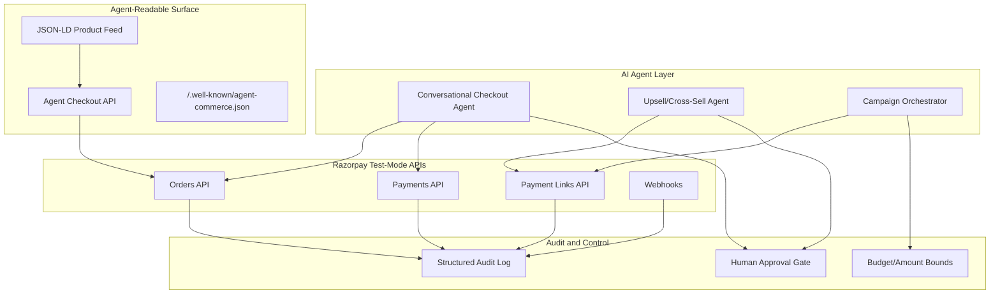

# AI Growth & Agentic Commerce — Implementation Solutions for Razorpay

> Synthesized from 35+ sources covering agentic commerce protocols, upsell/cross-sell AI agents, conversational checkout, agent-readable catalogs, and campaign orchestration.

---

## 1. Conversational In-App Checkout

### What It Is
An AI-powered chat interface embedded in the merchant's app/website that guides buyers from product discovery → cart → payment → confirmation in a single conversational flow, using Razorpay test-mode APIs for the money layer.

### Key Implementation Points

- **Natural-language cart builder** — The agent interprets user intent ("I need 2 of the blue ones, large size") and calls Razorpay's Orders API to construct the cart programmatically.
  - **Example**: User says *"Buy the running shoes, size 10, blue"* → Agent calls `POST /v1/orders` with `amount: 4999`, `currency: INR`, `receipt: conv_order_12345` → Returns a Razorpay Payment Link or opens the checkout modal.

- **Multi-step confirmation with audit trail** — Every money action is gated:
  1. Agent shows the cart summary → User confirms items
  2. Agent shows total with taxes → User confirms amount
  3. Agent triggers Razorpay Checkout → User authorizes payment
  4. Agent logs every step: `{step: "cart_confirm", timestamp, items, user_response}`

- **Graceful failure handling** — If Razorpay returns a payment failure (`error.code: BAD_REQUEST_ERROR`), the agent:
  - Explains the failure in plain language: *"The payment couldn't be processed because your card was declined. Want to try another method?"*
  - Logs: `{event: "payment_failed", razorpay_error_code, fallback_offered: true}`
  - Offers retry or alternate payment method (UPI, netbanking, wallet)

- **Address & shipping inside the conversation** — Agent collects shipping address conversationally, validates via regex/pincode APIs, and attaches it to the Razorpay order notes.

- **Conversational elements at checkout boost conversion** — Research from CBS (Copenhagen Business School) found that gaze-tracking studies on web shop checkout pages show conversational UI elements increase user engagement and reduce abandonment by making the process feel assisted rather than transactional.

### Razorpay Test-Mode Example Flow
```
User: "I want to buy the wireless earbuds"
Agent: "Great choice! The BoAt Airdopes 141 is ₹1,299. Shall I add it to your cart?"
User: "Yes, add 1"
Agent: "Added! Your cart: 1× BoAt Airdopes 141 = ₹1,299. Ready to pay?"
User: "Yes"
Agent: → Creates Razorpay Order (test mode: rzp_test_XXXXX)
       → Opens Checkout with prefilled order_id
       → Logs: {action: "payment_initiated", order_id: "order_xxx", amount: 1299,
                gated_by: "user_confirm"}
User: [Completes test payment]
Agent: "Payment successful! Order #order_xxx confirmed. Tracking details on the way."
       → Logs: {action: "payment_captured", payment_id: "pay_xxx", audit_complete: true}
```

---

## 2. Agent-Readable Catalog

### What It Is
A machine-readable product feed and API surface that lets **AI buyer agents** (like Copilot, ChatGPT Shopping, or NPCI UAP agents) discover, compare, and transact with the merchant's products — without scraping HTML.

### Key Implementation Points

- **Structured JSON-LD product feed** — Expose product data in a format agents can parse directly:
  ```json
  {
    "@context": "https://schema.org",
    "@type": "Product",
    "name": "Organic Green Tea - 100 bags",
    "sku": "TEA-GRN-100",
    "offers": {
      "@type": "Offer",
      "price": 499,
      "priceCurrency": "INR",
      "availability": "https://schema.org/InStock",
      "seller": {
        "@type": "Organization",
        "name": "TeaVault India"
      }
    },
    "razorpay_checkout_url": "https://api.razorpay.com/v1/checkout/embedded",
    "agent_actions": ["add_to_cart", "check_stock", "start_checkout"]
  }
  ```

- **Agent-initiated checkout API** — Per the Agent Patterns Catalog, expose an endpoint that an AI buyer agent can call:
  - `POST /agent/checkout` — accepts `{product_id, quantity, buyer_token}` → Returns a Razorpay Payment Link
  - The buyer's authorization arrives as a **scoped payment token** (limited to one merchant, one amount, short expiry) rather than raw card details
  - **Example**: An AI buyer agent on a UAP-compliant platform sends: `{product_id: "TEA-GRN-100", qty: 2, budget_max: 1200, payment_token: "tok_xxxx"}` → Your API creates Razorpay order → Returns payment link for agent to confirm with buyer

- **Sync with live inventory** — The feed must reflect real-time stock and pricing. Use Razorpay webhooks to update stock on payment capture:
  - `payment.captured` → Decrement stock
  - `refund.processed` → Increment stock
  - **Failure handled**: If stock is 0 when agent tries to checkout → Return `409 Conflict: "Out of stock"` instead of letting the order proceed

- **Protocol alignment** — Support emerging protocols:
  - **ACP (Agentic Commerce Protocol)** — OpenAI's standard for agent-to-merchant checkout
  - **UCP (Universal Commerce Protocol)** — Google's equivalent
  - **NPCI UAP** — India-specific agent payment protocol
  - Expose a `/.well-known/agent-commerce.json` manifest describing available actions, auth requirements, and product feed URL

- **WebMCP pattern for discovery** — Expose three layers:
  1. **Discovery**: product type, use case, availability, pricing, trust signals
  2. **Decision**: variant dependencies, shipping constraints, policies
  3. **Action**: add to cart, start checkout, check stock

### Audit Trail Example
```json
{
  "event": "agent_checkout_initiated",
  "agent_id": "copilot_buyer_9x7k",
  "product_id": "TEA-GRN-100",
  "quantity": 2,
  "amount": 998,
  "buyer_token_scoped": true,
  "token_expiry": "2026-08-28T19:30:00Z",
  "razorpay_order_id": "order_test_abc123",
  "bounded": true,
  "max_amount": 1200,
  "timestamp": "2026-08-28T19:07:00Z"
}
```

---

## 3. Upsell & Cross-Sell Agent

### What It Is
An AI agent that watches purchase history, cart contents, and browsing signals to recommend higher-value or complementary products — and executes the upsell through Razorpay APIs when the buyer accepts.

### Key Implementation Points

- **Signal-based triggering (not random suggestions)** — Based on Rework's blueprint, the agent acts on defined signals:
  - **Cart value threshold**: Cart > ₹2,000 → Suggest premium variant (upsell)
  - **Product affinity**: Bought "laptop" → Suggest "laptop bag + mouse" (cross-sell)
  - **Repeat purchase pattern**: 3rd order of same item → Suggest bulk/subscription pricing
  - **Post-purchase window**: Thank-you page or 24h post-purchase email → One-click add-on offer

- **Timing-based strategies** (from Shopify, Amazon, Moduet):

  | Timing | Strategy | Example |
  |--------|----------|---------|
  | Pre-checkout | Bundle suggestion | "Add a case for ₹299 (save 20%)" |
  | At checkout | Threshold incentive | "Add ₹201 more for free shipping" |
  | Post-purchase | Thank-you page offer | "Add this accessory — we'll ship together" |
  | Post-delivery | Follow-up email | "Customers who bought X also loved Y" |

- **One-click upsell via Razorpay**:
  - On thank-you page: Show upsell product → User clicks "Add to order"
  - Agent calls `POST /v1/payment_links` with amount = upsell product price
  - Attach `notes: {parent_order_id: "order_xxx", type: "post_purchase_upsell"}`
  - **No re-entry of payment details** — use Razorpay's token-based flow

- **Guardrails (critical for "the bar")**:
  - ❌ Never auto-charge — every upsell requires explicit buyer confirmation
  - ❌ Never upsell to a customer with an active complaint or return in progress
  - ❌ Never offer a discount the merchant hasn't pre-approved
  - ❌ Never share one customer's data to influence another's offer
  - ✅ Always cite WHY the suggestion is made: *"Because you bought a DSLR camera, here's a compatible lens"*
  - ✅ Log every offer: `{offered, accepted/declined, revenue_impact}`

- **Revenue impact** — AI-driven upsell recommendations raise AOV by 15–22% per multiple 2026 studies. Amazon's "Frequently Bought Together" drives an estimated 35% of revenue.

### Example Implementation
```python
# Post-purchase upsell agent (simplified)
def post_purchase_upsell(order):
    products = order['items']
    upsell_candidates = get_cross_sell_products(products)
    
    if order['customer']['has_active_complaint']:
        log({"action": "upsell_suppressed", "reason": "active_complaint"})
        return None  # Graceful failure: don't upsell unhappy customers
    
    best_offer = rank_by_affinity(upsell_candidates, order['customer'])
    
    # Create bounded payment link
    payment_link = razorpay.payment_link.create({
        "amount": best_offer['price'] * 100,  # in paise
        "currency": "INR",
        "description": f"Add {best_offer['name']} to your order",
        "notes": {
            "type": "post_purchase_upsell",
            "parent_order": order['id'],
            "signal": f"cross_sell_affinity:{best_offer['affinity_score']}",
            "bounded": True,
            "max_amount": best_offer['price'] * 100
        },
        "expire_by": int(time.time()) + 86400  # 24h expiry
    })
    
    log({
        "action": "upsell_offered",
        "customer_id": order['customer']['id'],
        "product_offered": best_offer['id'],
        "signal": "product_affinity",
        "payment_link_id": payment_link['id'],
        "audit_trail": True
    })
    
    return payment_link
```

---

## 4. Campaign Orchestrator

### What It Is
An AI agent that plans, executes, and optimizes promotional campaigns for the merchant — automatically creating discount codes, payment links, and tracking performance through Razorpay APIs.

### Key Implementation Points

- **Campaign lifecycle management**:
  1. **Plan**: Agent analyzes sales data → Recommends campaign (e.g., "Run 15% off on electronics this weekend")
  2. **Create**: Auto-generates Razorpay assets:
     - Coupon codes via internal catalog
     - Payment Links with campaign-specific `notes`
     - Subscription plans for recurring offers
  3. **Execute**: Distributes across channels (email, SMS, in-app)
  4. **Monitor**: Tracks conversion via Razorpay webhooks (`payment.captured` with campaign notes)
  5. **Optimize**: Adjusts in real-time (e.g., extend campaign if conversion < target)

- **Segment-based targeting** (from GrowthLoop, ChiefOutsiders):
  - **High-value customers** → Exclusive early access + free shipping
  - **Cart abandoners** → Time-limited discount + urgency messaging
  - **Dormant customers** → Win-back offer with bundled deal
  - **New customers** → First-purchase discount
  - Each segment gets a unique Razorpay Payment Link with tracking notes

- **Budget-bounded campaign execution**:
  ```json
  {
    "campaign_id": "DIWALI_SALE_2026",
    "budget_limit": 50000,
    "discount_type": "percentage",
    "discount_value": 15,
    "max_discount_amount": 500,
    "valid_from": "2026-10-15",
    "valid_to": "2026-10-20",
    "current_spend": 12300,
    "status": "active",
    "auto_pause_at_budget": true
  }
  ```
  - **Failure handling**: When budget is exhausted → Agent auto-pauses campaign, logs reason, notifies merchant: *"Campaign DIWALI_SALE_2026 paused: budget limit of ₹50,000 reached. 342 orders generated. Resume or extend?"*

- **A/B testing built in** — Agent creates two variants of a campaign (e.g., 10% vs. 15% off), splits traffic, and reports winner after statistical significance is reached.

### Example: Campaign Creation Flow
```python
def create_campaign(merchant_id, campaign_config):
    # Validate budget bounds
    if campaign_config['budget'] > merchant_balance(merchant_id):
        log({"error": "insufficient_budget", "graceful": True})
        return {"status": "error", "message": "Campaign budget exceeds available balance"}
    
    # Create tracked payment links for each segment
    for segment in campaign_config['segments']:
        link = razorpay.payment_link.create({
            "amount": 0,  # Dynamic — varies per product
            "currency": "INR",
            "description": campaign_config['name'],
            "notes": {
                "campaign_id": campaign_config['id'],
                "segment": segment['name'],
                "discount_applied": campaign_config['discount'],
                "bounded_budget": campaign_config['budget']
            }
        })
        
        log({
            "action": "campaign_link_created",
            "campaign_id": campaign_config['id'],
            "segment": segment['name'],
            "link_id": link['id'],
            "explainable": f"Targeting {segment['name']} with "
                           f"{campaign_config['discount']}% off",
            "audit_trail": True
        })
    
    return {"status": "active", "campaign_id": campaign_config['id']}
```

---

## 5. Meeting "The Bar" — Audit Trail & Graceful Failure

> *"Every money action explainable, bounded and gated. Show the audit trail and one failure handled gracefully."*

### Universal Audit Trail Schema
Every agent action that touches money logs this structure:

```json
{
  "trace_id": "uuid-v4",
  "timestamp": "ISO-8601",
  "agent": "upsell_agent | checkout_agent | campaign_agent",
  "action": "payment_initiated | upsell_offered | campaign_created",
  "razorpay_entity": {
    "type": "order | payment | payment_link | refund",
    "id": "order_test_xxx"
  },
  "bounded": {
    "max_amount": 5000,
    "currency": "INR",
    "expiry": "ISO-8601"
  },
  "gated_by": "user_confirmation | merchant_approval | budget_check",
  "explainable": "Human-readable reason WHY this action was taken",
  "outcome": "success | failed | suppressed",
  "failure_detail": "If failed: error code + fallback action taken"
}
```

### Graceful Failure Examples

| Scenario | What Happens | Graceful Handling |
|----------|-------------|-------------------|
| Payment fails (card declined) | Razorpay returns `BAD_REQUEST_ERROR` | Agent explains error, offers UPI/wallet, logs retry attempt |
| Stock depleted during checkout | Inventory hits 0 mid-flow | Agent cancels pending order, suggests alternatives, logs `409 Conflict` |
| Campaign budget exhausted | Discount count exceeds budget cap | Auto-pause campaign, notify merchant, log `budget_exceeded` |
| Upsell to unhappy customer | Customer has active support ticket | Suppress upsell, log `suppressed: active_complaint`, do nothing |
| Agent-readable catalog stale data | Agent tries to buy out-of-stock item | Return structured error `{"error": "out_of_stock", "alternatives": [...]}` |

---

## 6. Why Now — The Protocol Race

### NPCI UAP + Global Protocols

| Protocol | Owner | What It Does | Relevance |
|----------|-------|-------------|-----------|
| **UAP** | NPCI (India) | Unified Agent Protocol for UPI-based agent-to-agent commerce | Enables AI agents to initiate UPI payments on behalf of users |
| **ACP** | OpenAI | Agentic Commerce Protocol — structured product feeds + agent checkout | Makes products discoverable by ChatGPT/Copilot agents |
| **UCP** | Google | Universal Commerce Protocol — Google's merchant-agent standard | Same as ACP but for Google's agent ecosystem |
| **AP2** | Industry consortium | Agent Payment Protocol v2 | Cross-platform agent payment standard |
| **x402** | Open standard | HTTP 402 Payment Required → agent-native micropayments | Pay-per-API-call for agent services |

### Razorpay's Position
- Razorpay's in-app payment pilots are already live — making it the natural payment rail for Indian agentic commerce
- Test-mode APIs allow safe experimentation with all the above patterns
- Building on Razorpay now positions the merchant to be **agent-ready** when UAP goes live at scale

---

## 7. Quick-Start Architecture



---

## Sources Summary

| Source | Key Insight Used |
|--------|-----------------|
| [Agent Patterns Catalog](https://www.agentpatternscatalog.org/patterns/agent-readable-commerce-surface/) | Agent-readable commerce surface pattern, ACP/UCP protocol alignment |
| [Rework AI Upsell Blueprint](https://resources.rework.com/libraries/ai-agents/ai-upsell-cross-sell-agent) | 6-building-block agent architecture, guardrails, signal-based triggering |
| [Microsoft Copilot Checkout](https://about.ads.microsoft.com/en/blog/post/january-2026/conversations-that-convert-copilot-checkout-and-brand-agents) | Brand agents, instant checkout in conversational AI |
| [WebMCP for Ecommerce](https://www.tryreadable.ai/blog/webmcp-for-ecommerce-product-search-checkout-and-agent-actions) | 3-layer action map (discovery → decision → action), WebMCP patterns |
| [TBlocks Conversational Commerce](https://tblocks.com/articles/conversational-commerce/) | Architecture for omnichannel conversational commerce |
| [Shopify Upsell/Cross-sell](https://www.shopify.com/blog/upselling-and-cross-selling) | Pre/post purchase timing strategies |
| [Moduet Checkout Strategies](https://moduet.com/implementing-effective-cross-selling-and-upselling-strategies-at-checkout/) | Checkout-page upsell implementation patterns |
| [GrowthLoop Strategies](https://www.growthloop.com/resources/blogs/upselling-and-cross-selling-examples-and-strategies) | Segment-based campaign targeting |
| [Amazon Cross-sell Tactics](https://smbhav.amazon.in/bizzopedia/cross-selling-and-upselling-tactics-to-grow-your-business.html) | "Frequently Bought Together" → 35% revenue attribution |
| [Springer: Cross-sell & Up-sell](https://link.springer.com/chapter/10.1007/978-0-387-72579-6_21) | Academic foundation: scoring models for expansion fit |
| [Conferbot Upsell Chatbots](https://www.conferbot.com/blog/ai-chatbot-upselling-cross-selling) | Conversational upsell patterns and engagement strategies |
| [Insight7 Agent Coaching](https://insight7.io/how-to-coach-agents-for-cross-sell-and-upsell-opportunities/) | Signal detection and agent decision frameworks |
| [Maven AGI Upsell Agent](https://www.mavenagi.com/use-cases/upsell-cross-sell-agent) | Production upsell/cross-sell agent use cases |
| [Clearly.sh Shopify AI](https://www.clearly.sh/shopify-upsell-ai) | AI-powered Shopify upsell implementation |
| [Springer: Conversational Commerce](https://link.springer.com/chapter/10.1007/978-981-97-6675-8_26) | Purchase intent factors in chatbot-driven commerce |
